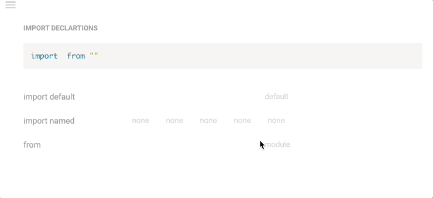

## Import for ES

> js, ts, jsx, tsx, vue, svelte

```js
const m = require("module");

import * as m from "module";

// with `allowSyntheticDefaultImports`
import m from "module";


import defaultExport from "module-name";
import * as name from "module-name";
import { export1 } from "module-name";
import { export1 as alias1 } from "module-name";
import { export1 , export2 } from "module-name";
import { foo , bar } from "module-name/path/to/specific/un-exported/file";
import { export1 , export2 as alias2 , [...] } from "module-name";
import defaultExport, { export1 [ , [...] ] } from "module-name";
import defaultExport, * as name from "module-name";
import "module-name";
var promise = import("module-name");
```

[reference](https://developer.mozilla.org/en-US/docs/Web/JavaScript/Reference/Statements/import)

## Import for dart

> dart

```dart
import 'dart:html';

import 'package:test/test.dart';

import 'package:lib2/lib2.dart' as lib2;

// Import only foo.
import 'package:lib1/lib1.dart' show foo;

// Import all names EXCEPT foo.
import 'package:lib2/lib2.dart' hide foo;
```

[reference](https://dart.dev/guides/language/language-tour#using-libraries)

## Import for Python

```py
from fibo import *
import fibo as fib
from fibo import fib, fib2
from fibo import fib as fibonacci

import sound.effects.echo
# sound.effects.echo.echofilter(input, output, delay=0.7, atten=4)

from sound.effects import echo
# echo.echofilter(input, output, delay=0.7, atten=4)

from . import echo
from .. import formats
from ..filters import equalizer
```

[reference](https://docs.python.org/3/tutorial/modules.html)
